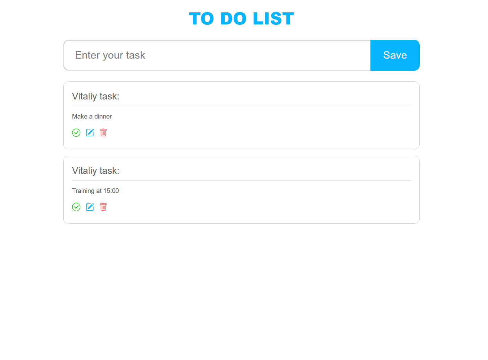
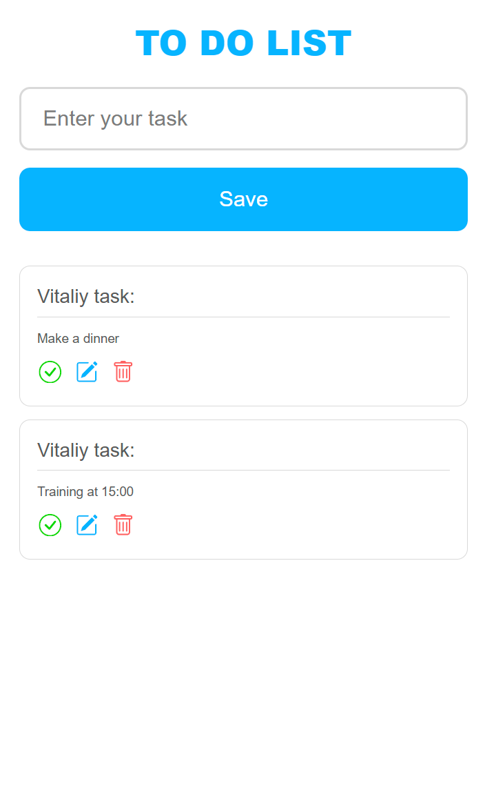

# 📝 ToDo App — React + Firebase + TanStack Query

This is a modern ToDo app built with React, using Firebase and TanStack Query to work with the database and optimize asynchronous logic.

## 🔧 Technologies
- React (Hooks)
- Firebase (Realtime Database)
- TanStack Query
- Axios
- SCSS
- Semantic and responsive layout

## 🚀 Features
- Create, edit, and delete tasks
- Real-time task saving through Firebase
- Data loading and state handling (loading, error)
- Responsiveness and mobile device support
- React component optimization for fast performance

## 📸 Screenshots

| Desktop | Mobile |
|--------|--------|
|  |  |

## 🔗 Demo
[Go to the app](https://vasylykiv.github.io/Pet-Todo-React-Firebase/)

## 🗂️ Local Installation

```bash
git clone https://github.com/vasylykiv/Pet-Todo-React-Firebase.git
cd Pet-Todo-React-Firebase
npm install
npm run dev
